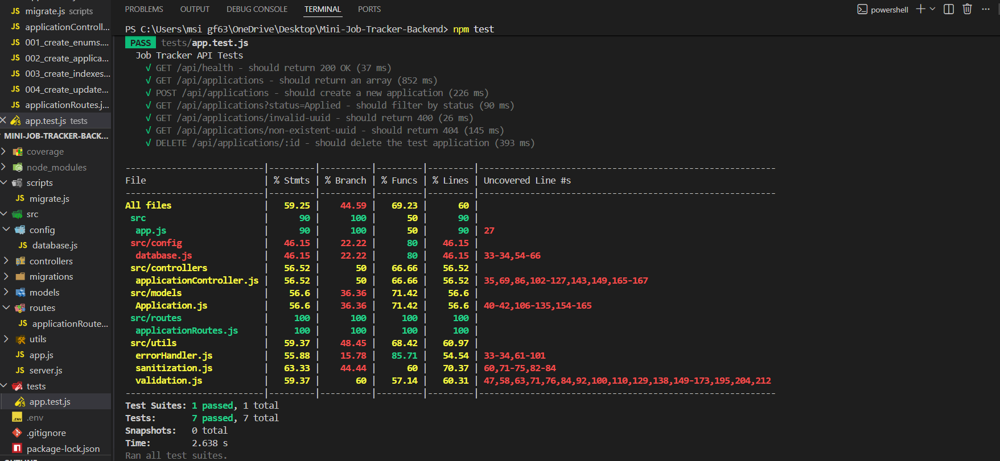
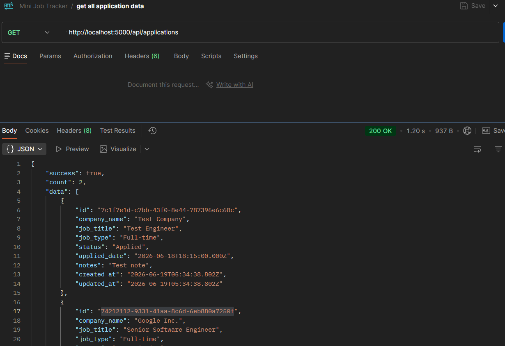
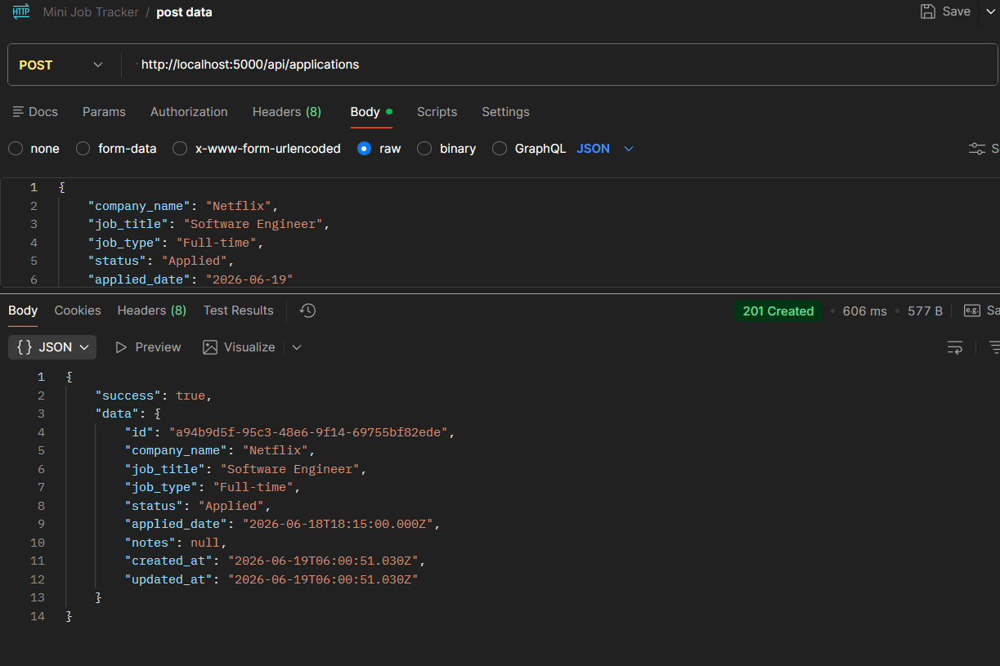

# 📋 Job Tracker API

A RESTful API for tracking job applications built with Node.js, Express, and PostgreSQL (Neon). This API allows users to manage their job applications with full CRUD operations, filtering, search, and statistics.

---

## 📸 Screenshots

### 🧪 Jest Test Results


*All tests passing with coverage report*

### 📬 Postman API Testing


*Getting all applications from the API*


*Creating a new application successfully*

---

## 📌 Project Overview

The Job Tracker API is a robust backend service that helps users organize and track their job applications. It provides endpoints to:

- ✅ Create new job applications
- ✅ Retrieve all applications with optional filtering
- ✅ Retrieve individual application details
- ✅ Update application status and details
- ✅ Delete applications
- ✅ Get application statistics (total, by status)

### Key Features

- **Search & Filter**: Search by company name or job title, filter by status
- **UUID Primary Keys**: Secure, globally unique identifiers
- **PostgreSQL with Neon**: Cloud-hosted database with automatic backups
- **MVC Architecture**: Clean separation of concerns
- **Comprehensive Error Handling**: Custom error classes with proper HTTP status codes
- **Input Validation**: Zod-like validation for all inputs
- **Input Sanitization**: XSS protection and data cleaning
- **Database Migrations**: Version-controlled schema changes
- **Unit Tests**: Jest tests with 60%+ coverage
- **ES Module Support**: Modern JavaScript with import/export

---

## 🛠 Tech Stack

### Backend
| Technology | Version | Purpose |
|------------|---------|---------|
| **Node.js** | 18.x+ | JavaScript runtime |
| **Express.js** | 5.x | Web framework |
| **PostgreSQL** | 15+ | Relational database |
| **Neon** | - | Cloud PostgreSQL hosting |
| **pg** | 8.x | PostgreSQL client |
| **dotenv** | 16.x | Environment variables |
| **cors** | 2.x | Cross-origin resource sharing |

### Development & Testing
| Technology | Version | Purpose |
|------------|---------|---------|
| **Nodemon** | 3.x | Auto-restart server during development |
| **Jest** | 29.x | Testing framework |
| **Supertest** | 6.x | HTTP assertion library |

---

## 📋 Prerequisites

Before you begin, ensure you have the following installed:

- [Node.js](https://nodejs.org/) (v18 or higher)
- [npm](https://www.npmjs.com/) (v8 or higher)
- [PostgreSQL](https://www.postgresql.org/) (v15 or higher) or [Neon](https://neon.tech/) account
- [Git](https://git-scm.com/) (for cloning the repository)

---

## 🔧 Installation

### 1. Clone the Repository

```bash
git clone https://github.com/AayushKK/Mini-Job-Tracker-Backend.git
cd Mini-Job-Tracker-Backend
